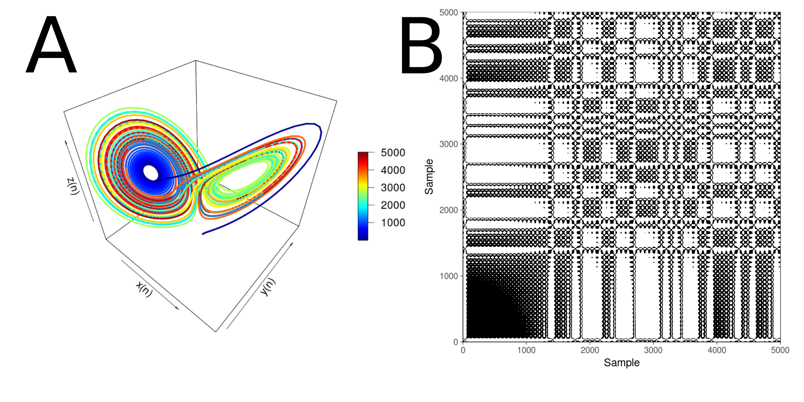

# Introduction

* The introduction should introduce the original paper and put it in context
(e.g. is it an important paper in the domain ?). 

The work of @marwan2015 on Recurrence Quantification is a good start to
understand how recurrence plots work. However, while replicating 
Figure 1.1 @fig:11 and Figure 1.2 @fig:12 in chapter one of @marwan2015.

* You must also specify if there
was an implementation available somewhere and provide a link to it if relevant
(and in such a case, you have to specify if the proposed replication is based
on this original implementation).

* You should also introduce your implementation
by listing language, tools, libraries, etc. and motivate choices if relevant.

# Methods

The methods section should explain how you replicated the original results:

* did you use paper description
* did you contact authors ?
* did you use original sources ?
* did you modify some parts ?
* etc.

If relevevant in your domain, you should also provide a new standardized
description of the work.

# Results

Results should be compared with original results and you have to explain why
you think they are the same or why they may differ (qualitative result vs
quantitative result). Note that it is not necessary to redo all the original
analysis of the results.

{#fig:11}

{#fig:12}

# Conclusion

Conclusion, at the very minimum, should indicate very clearly if you were able
to replicate original results. If it was not possible but you found the reason
why (error in the original results), you should exlain it.

Heading 1                          Heading 2
---------- ----------- ----------- ----------- ----------- -----------
cell1 row1 cell2 row 1 cell3 row 1 cell4 row 1 cell5 row 1 cell6 row 1
cell1 row2 cell2 row 2 cell3 row 2 cell4 row 2 cell5 row 2 cell6 row 2
cell1 row3 cell2 row 3 cell3 row 3 cell4 row 3 cell5 row 3 cell6 row 3
---------- ----------- ----------- ----------- ----------- -----------

Table: Table caption {#tbl:table}

A reference to table @tbl:table.
A reference to equation @eq:1.
A reference to citation @markdown.

$$ A = \sqrt{\frac{B}{C}} $$ {#eq:1}

# References
